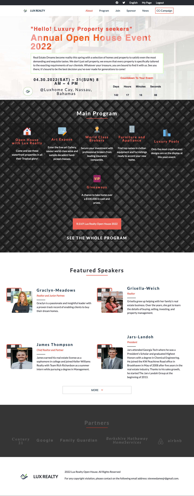
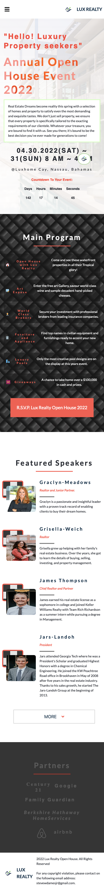
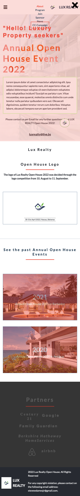

# 🏡 Capstone Real Estate Project


---

## 📖 Table of Contents

- About the Project  
- Built With  
- Live Demo  
- Features  
- Screenshots  
- Getting Started  
- Author  
- Future Improvements  
- License  

---

## 📌 About the Project

Capstone Real Estate एक responsive web application है जो users को luxury properties explore करने का clean और modern experience देता है।

इस project को **real-world UI/UX standards** को ध्यान में रखकर बनाया गया है ताकि:
- Layout clean रहे  
- Navigation simple हो  
- Mobile experience smooth हो  

---

## 🛠️ Built With

- HTML5 (Structure)
- CSS3 (Styling & Responsiveness)
- JavaScript (Interactivity)

---

## 🚀 Live Demo

👉 [Open Live Project] : https://harshit-sharma-52.github.io/capstone-real-estate/

---

## ✨ Features

✔ Responsive design (Mobile + Desktop)  
✔ Interactive navigation menu  
✔ Dropdown menu for mobile  
✔ Clean UI structure  
✔ Smooth user experience  
✔ Organized property sections  

---

## 📸 Screenshots

### 🖥️ Desktop View


### 📱 Mobile View


### 📱 Mobile Navigation Menu


---

## ⚙️ Getting Started

To run this project locally:

### 1. Clone the repository
```bash
git clone https://github.com/Harshit-Sharma-52/capstone-real-estate.git
